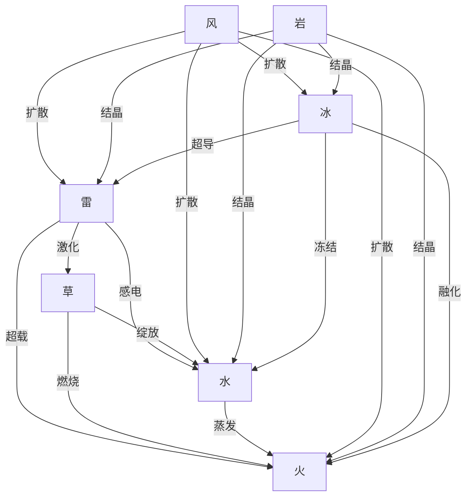
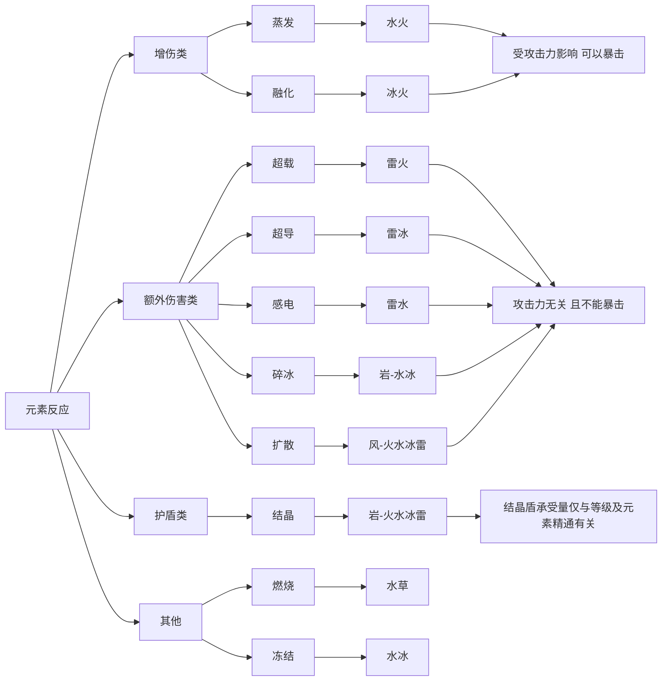

# 我的原神旅行观测记录

## 1、说明

《我的原神旅行观测记录》，又名《原神之旅》，记之以事，述之以情。 
自二零二二年十一月初开始下载原神，第一次玩这款全球知名游戏。安装包300多兆，但是装好后还要下载18g的资源，确实很大。 
之前只玩过功能比较简单、内容相对单一的游戏，像qq农场、部落冲突、天天酷跑、和平精英等等。 
世界规模如此巨大，内容剧情如此精彩，画面色彩如此绚丽的游戏还是首次接触。 
想不到一接触就入迷了，一入迷难以自拔，故此记录，以作旅行感想。 
原神UID：254901679，欢迎加好友。文档记录于个人[网站]( https://blog.xushufa.cn )，欢迎浏览。 
--20221124

## 2、旅行笔记

原神 旅行者 [米游社]( https://bbs.mihoyo.com/ys/ )

提瓦特  蒙德  璃月 岩层巨渊   稻妻  须弥

班尼特 芭芭拉 丽莎 香菱 安柏 凝光 提纳里 雷神 

### 2.1、日志

> 新手菜鸟萌新注意点

1.星落湖-七天神像，一直困在那里，走不出去，也游不出去，需要学会龙卷风技能，才有新天地。    
2.蒙德城外的四庙遗址，去下一关有一道天堑需要飞过去。需要切换安柏长按火箭，射击石像，才有一片云雾，飘过天堑。    
--20221103

3.打火姬安柏30秒内点燃火炬并打开宝箱，手残党，一直失败。    
4.南风之狮的庙宇20秒杀死一个小怪，限制时间内清光所有怪物。冒险等级19级，角色等级30左右。只有丽莎有一战之力，但是技术还是不行，一直失败。    
旅行者，安柏，凯亚，丽莎。    
--20221109

> 角色搭配

5.前期冒险等级45级以下的萌新玩家，没有五星角色，可以合适搭配四星角色。    
如当前我有十个角色：旅行者，御三家：安柏、凯亚、丽莎；凝光，烟绯，班尼特，芭芭拉，雷泽，诺艾尔。    
主c、副c、奶妈、工具人四个角色组合：凝光，烟绯，班尼特，芭芭拉。    
凝光，烟绯，班尼特 是主c；班尼特 是副c；奶妈是芭芭拉。    
冒险等级29级，最高角色等级49左右。    
--20221116

> 元素反应

6.有大佬好友教了一下 要搭配不同人物  打出元素反应  实在是强    
原神元素关系图    
https://bbs.mihoyo.com/ys/article/29312495    
https://bbs.mihoyo.com/ys/article/30600790    
--20221118

7.打元素反应 升等级  武器   圣遗物   

班尼特：充能  当前69级    
丽莎：元素精通   59级    
草主：充能 攻击力   67级    
芭芭拉：治疗 生命值   60级    
感电超载燃烧超绽放元素融合    

注意使用尘歌壶    
--20221122

完成反雷电将军特训  简直就是 反旅行者特训    
班丽主芭  69级  等冒险等级40突破70级    
--20221124

---

8.冒险等级 世界等级 尘歌壶

冒险等级升到40级，世界等级也随之升到5级。怪物的级别也提高了，不太好打，没有之前那种一击毙命的感觉。   
还是要继续升级角色，升级武器，升级圣遗物。做任务，拿经验。打boss，开宝箱。循环往复，曲线向前。   

对于尘歌壶也稍有了解，基本能熟练使用了。   
升级有原石拿，并且可以锻造兵器，种植风车菊。  
--20221125

想要打出高伤害值，最好四个人物配置四种元素打反应。而且最好有雷元素，因为雷火超载，雷水感电伤害最高。  
班尼特--风车菊，芭芭拉--慕枫蘑菇，丽莎--落落莓，各种材料注意平常积累，基本是48小时才刷新。  
没有垃圾角色，只有垃圾配置。最合适方式搭配最合适角色发挥最大化战力。  
--20221128

尘歌壶妙用无穷，6级信任可以买树脂和经验包。  
如何升级信任等级只能制作新摆设。  
如何购买新摆设，通过仙力值。  
如何增加仙力值，室外摆石狮子，室内放屏风最划算。  
石狮子需要白铁矿，通过探索派遣和挖矿。  
屏风【松木折屏-云来帆影】需要松木，在蒙德靠近凯瑟琳的传送点有三处松木，循环砍伐。  
--20221129

---

9.六星战神 绝缘本 雷神国家队

昨天冒险等级达到50级，突破任务也成功了，世界等级达到7级。  
目前使用的人物跟一个月前差别不大： 
班尼特：宗室套 生命充能治疗  当前81级  西风剑  
芭芭拉：少女圣遗物  生命治疗 80级  试作金珀  
香菱： 2绝缘2角斗  充能双暴 80级  鱼获  
丽莎：元素精通   80级 魔导绪论   

班尼特六星战神名不虚传，补血增伤，确实厉害。芭芭拉辅助奶妈补血恢复非常给力。  
香菱锅巴喷火、后台挂火伤害可观。丽莎，堆元素精通点按e，1秒冷却打反应相当好用。  

尘歌壶也到了9级，兑换须臾数值、经验值、精锻晶石等相当不错。  
xp党指喜欢、偏爱，外貌协会。雷神既是xp党也是强度党。  

现在在攒原石，等12.27号3.3版本下半场雷神复刻。同时收集材料：雷音权现的雷云庭珠，最胜紫晶、名刀镡、天云草实。技能天赋材料：「天光」的哲学、溶毁之刻、名刀镡、智识之冕。  
小保底90抽之前歪了，大保底90抽没问题了。抽到雷神的话，看看能否有行秋，和班尼特香菱组成雷神国家队。  
--20221219

### 2.2、感想

原神是相对**单机**的游戏，喜欢哪个人物就升级哪个。但是探索世界的时候要打得过boss。  
角色池子里人物抽不到就算了，不用纠结，练现有的就行。  
世界如此美好，凡事不要急躁。任务过不去也要保持**平常心**。  

一刀一枪的劈砍伤害值太低，还是要多种角色组合搭配打**元素反应**才牛b。  
雷火超载，雷水感电的伤害值就是高。  
御三家还是有用的，安柏打火姬，丽莎后台挂雷，凯亚碎冰冻结。  
旅行者基本只有草主才有用，其他风主、岩主、雷主太弱了。  
**班尼特**不愧是六星战神，实在是强，着重培养。  
注意升级顺序重要性，冒险等级>人物等级>武器等级>圣遗物的等级。  

常有大佬东游西逛，申请进入我的世界，太厉害的boss请他们打。  
之前很少玩游戏的，手残党，最好在20级之前不要让别人进入你的世界。自己慢慢**体验**，感受，进步。  
过早让大佬带，会让自己产生依赖，而且没有参与感，也不能提高走位技术。  
原神遇到问题就在**米游社**查攻略查方法。  

目前已玩原神近一个月，没充钱，世界等级4，冒险等级39，常用角色班尼特、丽莎、草主、芭芭拉都是69级，火雷草水。基本可以说能仗剑走天涯，打怪打boss还是比较容易的。  

以上纯属个人感想，若有错误，欢迎指正。  
--20221124

### 2.3、雷神

[雷电将军]( https://bbs.mihoyo.com/ys/obc/content/2404/detail )  梦想一心  快到碗里来  
雷电将军，5星雷系长柄武器角色。其名为「雷电影」，魔神名讳为「巴尔泽布」，雷电将军只是称谓。前任雷电将军「雷电真」·巴尔与现任雷电将军「雷电影」·巴尔泽布是双生魔神，「真」在数百年前的战争中逝世，「影」便来到了幕前。许诺稻妻臣民“千世万代不变不移的永恒”，然而自己却在「永恒」里迷失···  

  

> 圣遗物

冒险等级45级之后就可以在**椛染之庭**刷绝缘套   
雷神毕业面板：60/180/270(暴击/暴伤/充能)    
雷神毕业面板参考：充能270+，双暴70-160(大毕业)，双暴65-120(小毕业)   

雷神的[绝缘之旗印]( https://bbs.mihoyo.com/ys/obc/content/2322/detail )圣遗物参考：   
主词条：花-生命，羽-攻击，沙-充能，杯-雷伤，冠-双暴。 **充能沙**，**雷伤杯**。   
副词条：只要暴击暴伤充能攻击力，不要防御生命值元素精通。   

生之花：明威之镡--生命值。   
死之羽：切落之羽--攻击力。   
时之沙：雷云之笼--元素充能效率。   
空之杯：涌泉之盏--雷元素伤害加成或攻击力。   
理之冠：华饰之兜--暴击率或暴击伤害。   
--20221219

  

> 专武命座

雷神大毕业状态**专武命座**伤害提升比较巨大，测算数据来自于[原神伤害计算]( https://genshin-calc.sirokuma.cc/ ) 。 
以下是雷电将军满级大毕业，天赋10、等级90、暴击60、暴伤170、充能270的暴击伤害：   

| 等级 |  武器  	 |  命座  |  暴击伤害 |  提升比例       | 
| ---  | ----------- |  ----  | --------- |  -------------- |
| 90   |  [鱼获]( https://bbs.mihoyo.com/ys/obc/content/2604/detail )  	 |  0	  |  20103    |  --             |  
| 90   |  鱼获  	 |  2	  |  28718	  |  +8615（43%）   |  
| 90   |  [薙草之稻光]( https://bbs.mihoyo.com/ys/obc/content/2602/detail ) |  0	  |  30133	  |  +10030（50%）  |  
| 90   |  薙草之稻光 |  2	  |  43047	  |  +22944（141%） |  

综上雷神专武命座对伤害提升显著：专武提升50%；专武加命座简直起飞了，可提升141%。  
--20221221

  

> 材料

雷神等级培养材料包括摩拉2092530，天云草实168，大英雄经验419，最胜紫晶碎屑1、断片9、晶块9、紫晶6，刀镡系列18、30、36，[雷霆数珠]( https://bbs.mihoyo.com/ys/obc/content/2615/detail )46，天赋材料包括摩拉4957500，王冠3，天光系列9、63、114，刀镡系列18、66、93，熔毁之刻18。

  

雷电将军**等级突破** LV1-90 所需材料:  
最胜紫晶碎屑×1 破旧的刀镡×18 雷霆数珠×46   
最胜紫晶断片×9 影打刀镡×30 天云草实×168   
最胜紫晶块×9 名刀镡×36 摩拉×420000   
最胜紫晶×6   

20级：最胜紫晶碎屑*1+天云草实*3+破旧的刀镡*3+2万摩拉   
40级：最胜紫晶断片*3+雷霆数珠*2+天云草实*10+破旧的刀镡*15+4万摩拉   
50级：最胜紫晶断片*6+雷霆数珠*4+天云草实*20+影打刀镡*12+6万摩拉   
60级：最胜紫晶块*3+雷霆数珠*8+天云草实*30+影打刀镡*18+8万摩拉   
70级：最胜紫晶块*6+雷霆数珠*12+天云草实*45+名刀镡*12+10万摩拉   
80级：最胜紫晶*6+雷霆数珠*20+天云草实*60+名刀镡*24+12万摩拉   

 

雷电将军**天赋突破** LV1-10 所需材料:  
天光的教导×3 破旧的刀镡×6 女士掉落材料×6   
天光的指引×21 影打刀镡×22 智识之冕×1   
天光的哲学×38 名刀镡×31 摩拉×1652500   

2级：天光的教导*3+破旧的刀镡*6   
3级：天光的指引*2+影打刀镡*3   
4级：天光的指引*4+影打刀镡*4   
5级：天光的指引*6+影打刀镡*6   
6级：天光的指引*9+影打刀镡*9   
7级：天光的哲学*4+名刀镡*4+熔毁之刻*1   
8级：天光的哲学*6+名刀镡*6+熔毁之刻*1   
9级：天光的哲学*12+名刀镡*9+熔毁之刻*2   
10级：天光的哲学*16+名刀镡*6+智识之冕*1+熔毁之刻*2   

## 3、观测枢

### 3.1、元素反应简图

来自 https://bbs.mihoyo.com/ys/article/30600790

火，水，风，雷，草，冰，岩   七种元素

---

### 3.2、元素反应机制讲解

来自 https://bbs.mihoyo.com/ys/article/2050152

- 元素反应的伤害均与触发角色的元素精通有着密切的联系。
- 超载的群体伤害最高。感电的单体伤害最高。

---

---

[^流程图]: 使用mermaid绘制流程图，但常用平台是三个单引号格式，vuepress项目是箭头格式。

